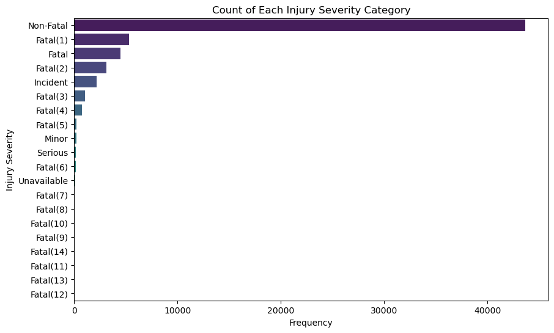
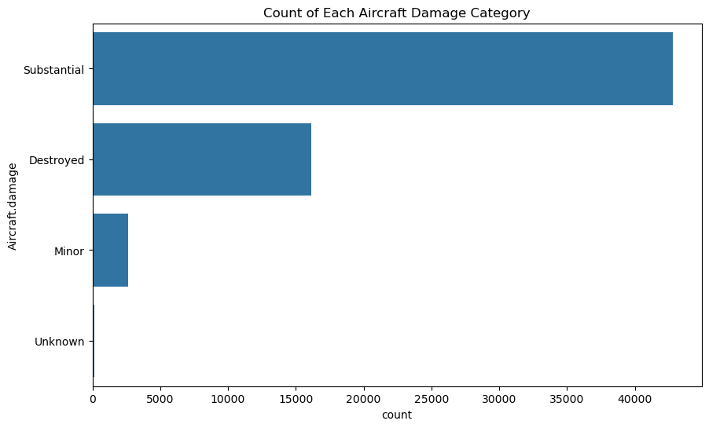
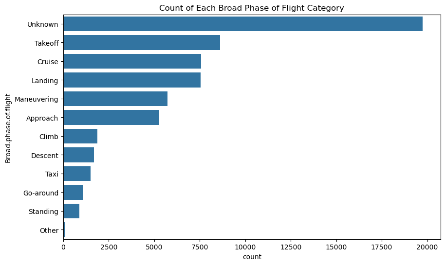
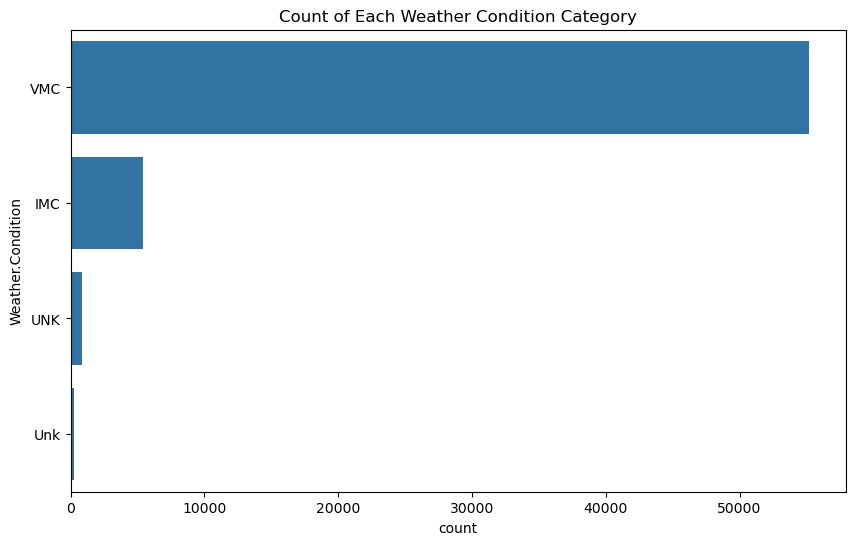
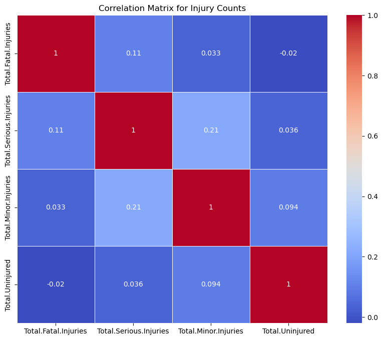

# Aviation Accident Database & Synopses, up to 2023

## About [Dataset](https://www.kaggle.com/datasets/khsamaha/aviation-accident-database-synopses)

### Content

The NTSB aviation accident database contains information from 1962 and later about civil aviation accidents and selected incidents within the United States, its territories and possessions, and in international waters.

### Acknowledgements

Generally, a preliminary report is available online within a few days of an accident. Factual information is added when available, and when the investigation is completed, the preliminary report is replaced with a final description of the accident and its probable cause. Full narrative descriptions may not be available for dates before 1993, cases under revision, or where NTSB did not have primary investigative responsibility.

### Inspiration

Hope it will teach us how to improve the quality and safety of traveling by Airplane.

> **Note:** We are using the [CRISP DM](https://www.datascience-pm.com/crisp-dm-2/) methodology to help use meet our requirements

## Understanding the data

### Loading the data 


```python
import pandas as pd
import numpy as np
import matplotlib.pyplot as plt
import seaborn as sns
%matplotlib inline
```


```python
df = pd.read_excel('./data/AviationData.xlsx')
df.head()
```


<div>
<style scoped>
    .dataframe tbody tr th:only-of-type {
        vertical-align: middle;
    }

    .dataframe tbody tr th {
        vertical-align: top;
    }

    .dataframe thead th {
        text-align: right;
    }
</style>
<table border="1" class="dataframe">
  <thead>
    <tr style="text-align: right;">
      <th></th>
      <th>Event.Id</th>
      <th>Investigation.Type</th>
      <th>Accident.Number</th>
      <th>Event.Date</th>
      <th>Location</th>
      <th>Country</th>
      <th>Latitude</th>
      <th>Longitude</th>
      <th>Airport.Code</th>
      <th>Airport.Name</th>
      <th>...</th>
      <th>Purpose.of.flight</th>
      <th>Air.carrier</th>
      <th>Total.Fatal.Injuries</th>
      <th>Total.Serious.Injuries</th>
      <th>Total.Minor.Injuries</th>
      <th>Total.Uninjured</th>
      <th>Weather.Condition</th>
      <th>Broad.phase.of.flight</th>
      <th>Report.Status</th>
      <th>Publication.Date</th>
    </tr>
  </thead>
  <tbody>
    <tr>
      <th>0</th>
      <td>20001218X45444</td>
      <td>Accident</td>
      <td>SEA87LA080</td>
      <td>1948-10-24</td>
      <td>MOOSE CREEK, ID</td>
      <td>United States</td>
      <td>NaN</td>
      <td>NaN</td>
      <td>NaN</td>
      <td>NaN</td>
      <td>...</td>
      <td>Personal</td>
      <td>NaN</td>
      <td>2.0</td>
      <td>0.0</td>
      <td>0.0</td>
      <td>0.0</td>
      <td>UNK</td>
      <td>Cruise</td>
      <td>Probable Cause</td>
      <td>NaN</td>
    </tr>
    <tr>
      <th>1</th>
      <td>20001218X45447</td>
      <td>Accident</td>
      <td>LAX94LA336</td>
      <td>1962-07-19</td>
      <td>BRIDGEPORT, CA</td>
      <td>United States</td>
      <td>NaN</td>
      <td>NaN</td>
      <td>NaN</td>
      <td>NaN</td>
      <td>...</td>
      <td>Personal</td>
      <td>NaN</td>
      <td>4.0</td>
      <td>0.0</td>
      <td>0.0</td>
      <td>0.0</td>
      <td>UNK</td>
      <td>Unknown</td>
      <td>Probable Cause</td>
      <td>19-09-1996</td>
    </tr>
    <tr>
      <th>2</th>
      <td>20061025X01555</td>
      <td>Accident</td>
      <td>NYC07LA005</td>
      <td>1974-08-30</td>
      <td>Saltville, VA</td>
      <td>United States</td>
      <td>36.922223</td>
      <td>-81.878056</td>
      <td>NaN</td>
      <td>NaN</td>
      <td>...</td>
      <td>Personal</td>
      <td>NaN</td>
      <td>3.0</td>
      <td>NaN</td>
      <td>NaN</td>
      <td>NaN</td>
      <td>IMC</td>
      <td>Cruise</td>
      <td>Probable Cause</td>
      <td>26-02-2007</td>
    </tr>
    <tr>
      <th>3</th>
      <td>20001218X45448</td>
      <td>Accident</td>
      <td>LAX96LA321</td>
      <td>1977-06-19</td>
      <td>EUREKA, CA</td>
      <td>United States</td>
      <td>NaN</td>
      <td>NaN</td>
      <td>NaN</td>
      <td>NaN</td>
      <td>...</td>
      <td>Personal</td>
      <td>NaN</td>
      <td>2.0</td>
      <td>0.0</td>
      <td>0.0</td>
      <td>0.0</td>
      <td>IMC</td>
      <td>Cruise</td>
      <td>Probable Cause</td>
      <td>2000-12-09 00:00:00</td>
    </tr>
    <tr>
      <th>4</th>
      <td>20041105X01764</td>
      <td>Accident</td>
      <td>CHI79FA064</td>
      <td>1979-08-02</td>
      <td>Canton, OH</td>
      <td>United States</td>
      <td>NaN</td>
      <td>NaN</td>
      <td>NaN</td>
      <td>NaN</td>
      <td>...</td>
      <td>Personal</td>
      <td>NaN</td>
      <td>1.0</td>
      <td>2.0</td>
      <td>NaN</td>
      <td>0.0</td>
      <td>VMC</td>
      <td>Approach</td>
      <td>Probable Cause</td>
      <td>16-04-1980</td>
    </tr>
  </tbody>
</table>
<p>5 rows × 31 columns</p>
</div>


> **Note**: This dataset is quite large so load just once. Had to load an excel file because csv results to an error


```python
df.shape
```


    (88889, 31)


```python
df.tail()
```


<div>
<style scoped>
    .dataframe tbody tr th:only-of-type {
        vertical-align: middle;
    }

    .dataframe tbody tr th {
        vertical-align: top;
    }

    .dataframe thead th {
        text-align: right;
    }
</style>
<table border="1" class="dataframe">
  <thead>
    <tr style="text-align: right;">
      <th></th>
      <th>Event.Id</th>
      <th>Investigation.Type</th>
      <th>Accident.Number</th>
      <th>Event.Date</th>
      <th>Location</th>
      <th>Country</th>
      <th>Latitude</th>
      <th>Longitude</th>
      <th>Airport.Code</th>
      <th>Airport.Name</th>
      <th>...</th>
      <th>Purpose.of.flight</th>
      <th>Air.carrier</th>
      <th>Total.Fatal.Injuries</th>
      <th>Total.Serious.Injuries</th>
      <th>Total.Minor.Injuries</th>
      <th>Total.Uninjured</th>
      <th>Weather.Condition</th>
      <th>Broad.phase.of.flight</th>
      <th>Report.Status</th>
      <th>Publication.Date</th>
    </tr>
  </thead>
  <tbody>
    <tr>
      <th>88884</th>
      <td>20221227106491</td>
      <td>Accident</td>
      <td>ERA23LA093</td>
      <td>2022-12-26</td>
      <td>Annapolis, MD</td>
      <td>United States</td>
      <td>NaN</td>
      <td>NaN</td>
      <td>NaN</td>
      <td>NaN</td>
      <td>...</td>
      <td>Personal</td>
      <td>NaN</td>
      <td>0.0</td>
      <td>1.0</td>
      <td>0.0</td>
      <td>0.0</td>
      <td>NaN</td>
      <td>NaN</td>
      <td>NaN</td>
      <td>29-12-2022</td>
    </tr>
    <tr>
      <th>88885</th>
      <td>20221227106494</td>
      <td>Accident</td>
      <td>ERA23LA095</td>
      <td>2022-12-26</td>
      <td>Hampton, NH</td>
      <td>United States</td>
      <td>NaN</td>
      <td>NaN</td>
      <td>NaN</td>
      <td>NaN</td>
      <td>...</td>
      <td>NaN</td>
      <td>NaN</td>
      <td>0.0</td>
      <td>0.0</td>
      <td>0.0</td>
      <td>0.0</td>
      <td>NaN</td>
      <td>NaN</td>
      <td>NaN</td>
      <td>NaN</td>
    </tr>
    <tr>
      <th>88886</th>
      <td>20221227106497</td>
      <td>Accident</td>
      <td>WPR23LA075</td>
      <td>2022-12-26</td>
      <td>Payson, AZ</td>
      <td>United States</td>
      <td>341525N</td>
      <td>1112021W</td>
      <td>PAN</td>
      <td>PAYSON</td>
      <td>...</td>
      <td>Personal</td>
      <td>NaN</td>
      <td>0.0</td>
      <td>0.0</td>
      <td>0.0</td>
      <td>1.0</td>
      <td>VMC</td>
      <td>NaN</td>
      <td>NaN</td>
      <td>27-12-2022</td>
    </tr>
    <tr>
      <th>88887</th>
      <td>20221227106498</td>
      <td>Accident</td>
      <td>WPR23LA076</td>
      <td>2022-12-26</td>
      <td>Morgan, UT</td>
      <td>United States</td>
      <td>NaN</td>
      <td>NaN</td>
      <td>NaN</td>
      <td>NaN</td>
      <td>...</td>
      <td>Personal</td>
      <td>MC CESSNA 210N LLC</td>
      <td>0.0</td>
      <td>0.0</td>
      <td>0.0</td>
      <td>0.0</td>
      <td>NaN</td>
      <td>NaN</td>
      <td>NaN</td>
      <td>NaN</td>
    </tr>
    <tr>
      <th>88888</th>
      <td>20221230106513</td>
      <td>Accident</td>
      <td>ERA23LA097</td>
      <td>2022-12-29</td>
      <td>Athens, GA</td>
      <td>United States</td>
      <td>NaN</td>
      <td>NaN</td>
      <td>NaN</td>
      <td>NaN</td>
      <td>...</td>
      <td>Personal</td>
      <td>NaN</td>
      <td>0.0</td>
      <td>1.0</td>
      <td>0.0</td>
      <td>1.0</td>
      <td>NaN</td>
      <td>NaN</td>
      <td>NaN</td>
      <td>30-12-2022</td>
    </tr>
  </tbody>
</table>
<p>5 rows × 31 columns</p>
</div>


```python
df.describe()
```


<div>
<style scoped>
    .dataframe tbody tr th:only-of-type {
        vertical-align: middle;
    }

    .dataframe tbody tr th {
        vertical-align: top;
    }

    .dataframe thead th {
        text-align: right;
    }
</style>
<table border="1" class="dataframe">
  <thead>
    <tr style="text-align: right;">
      <th></th>
      <th>Event.Date</th>
      <th>Number.of.Engines</th>
      <th>Total.Fatal.Injuries</th>
      <th>Total.Serious.Injuries</th>
      <th>Total.Minor.Injuries</th>
      <th>Total.Uninjured</th>
    </tr>
  </thead>
  <tbody>
    <tr>
      <th>count</th>
      <td>88889</td>
      <td>82805.000000</td>
      <td>77488.000000</td>
      <td>76379.000000</td>
      <td>76956.000000</td>
      <td>82977.000000</td>
    </tr>
    <tr>
      <th>mean</th>
      <td>1999-09-17 17:13:39.354475904</td>
      <td>1.146585</td>
      <td>0.647855</td>
      <td>0.279881</td>
      <td>0.357061</td>
      <td>5.325440</td>
    </tr>
    <tr>
      <th>min</th>
      <td>1948-10-24 00:00:00</td>
      <td>0.000000</td>
      <td>0.000000</td>
      <td>0.000000</td>
      <td>0.000000</td>
      <td>0.000000</td>
    </tr>
    <tr>
      <th>25%</th>
      <td>1989-01-15 00:00:00</td>
      <td>1.000000</td>
      <td>0.000000</td>
      <td>0.000000</td>
      <td>0.000000</td>
      <td>0.000000</td>
    </tr>
    <tr>
      <th>50%</th>
      <td>1998-07-18 00:00:00</td>
      <td>1.000000</td>
      <td>0.000000</td>
      <td>0.000000</td>
      <td>0.000000</td>
      <td>1.000000</td>
    </tr>
    <tr>
      <th>75%</th>
      <td>2009-07-01 00:00:00</td>
      <td>1.000000</td>
      <td>0.000000</td>
      <td>0.000000</td>
      <td>0.000000</td>
      <td>2.000000</td>
    </tr>
    <tr>
      <th>max</th>
      <td>2022-12-29 00:00:00</td>
      <td>8.000000</td>
      <td>349.000000</td>
      <td>161.000000</td>
      <td>380.000000</td>
      <td>699.000000</td>
    </tr>
    <tr>
      <th>std</th>
      <td>NaN</td>
      <td>0.446510</td>
      <td>5.485960</td>
      <td>1.544084</td>
      <td>2.235625</td>
      <td>27.913634</td>
    </tr>
  </tbody>
</table>
</div>


Isolate just the **interesting columns** that seem relevant to my research and contribute to business understanding [here](https://github.com/learn-co-curriculum/dsc-phase-1-project-v3)


```python
interesting_columns = [
    'Injury.Severity',
    'Aircraft.damage',
    'Aircraft.Category',
    'Make',
    'Model',
    'Number.of.Engines',
    'Engine.Type',
    'Weather.Condition',
    'Broad.phase.of.flight',
    'Total.Fatal.Injuries',
    'Total.Serious.Injuries',
    'Total.Minor.Injuries',
    'Total.Uninjured'
]
```

These _**variables**_ will help me analyze and compare the safety records, damage extent, and injury outcomes of different aircraft models and manufacturers, ultimately leading to informed recommendations for aircraft purchase decisions.


```python
df2 = df[interesting_columns].copy()  # it's crutial you use copy to avoid `SettingWithCopyWarning`
df2.head()
```


<div>
<style scoped>
    .dataframe tbody tr th:only-of-type {
        vertical-align: middle;
    }

    .dataframe tbody tr th {
        vertical-align: top;
    }

    .dataframe thead th {
        text-align: right;
    }
</style>
<table border="1" class="dataframe">
  <thead>
    <tr style="text-align: right;">
      <th></th>
      <th>Injury.Severity</th>
      <th>Aircraft.damage</th>
      <th>Aircraft.Category</th>
      <th>Make</th>
      <th>Model</th>
      <th>Number.of.Engines</th>
      <th>Engine.Type</th>
      <th>Weather.Condition</th>
      <th>Broad.phase.of.flight</th>
      <th>Total.Fatal.Injuries</th>
      <th>Total.Serious.Injuries</th>
      <th>Total.Minor.Injuries</th>
      <th>Total.Uninjured</th>
    </tr>
  </thead>
  <tbody>
    <tr>
      <th>0</th>
      <td>Fatal(2)</td>
      <td>Destroyed</td>
      <td>NaN</td>
      <td>Stinson</td>
      <td>108-3</td>
      <td>1.0</td>
      <td>Reciprocating</td>
      <td>UNK</td>
      <td>Cruise</td>
      <td>2.0</td>
      <td>0.0</td>
      <td>0.0</td>
      <td>0.0</td>
    </tr>
    <tr>
      <th>1</th>
      <td>Fatal(4)</td>
      <td>Destroyed</td>
      <td>NaN</td>
      <td>Piper</td>
      <td>PA24-180</td>
      <td>1.0</td>
      <td>Reciprocating</td>
      <td>UNK</td>
      <td>Unknown</td>
      <td>4.0</td>
      <td>0.0</td>
      <td>0.0</td>
      <td>0.0</td>
    </tr>
    <tr>
      <th>2</th>
      <td>Fatal(3)</td>
      <td>Destroyed</td>
      <td>NaN</td>
      <td>Cessna</td>
      <td>172M</td>
      <td>1.0</td>
      <td>Reciprocating</td>
      <td>IMC</td>
      <td>Cruise</td>
      <td>3.0</td>
      <td>NaN</td>
      <td>NaN</td>
      <td>NaN</td>
    </tr>
    <tr>
      <th>3</th>
      <td>Fatal(2)</td>
      <td>Destroyed</td>
      <td>NaN</td>
      <td>Rockwell</td>
      <td>112</td>
      <td>1.0</td>
      <td>Reciprocating</td>
      <td>IMC</td>
      <td>Cruise</td>
      <td>2.0</td>
      <td>0.0</td>
      <td>0.0</td>
      <td>0.0</td>
    </tr>
    <tr>
      <th>4</th>
      <td>Fatal(1)</td>
      <td>Destroyed</td>
      <td>NaN</td>
      <td>Cessna</td>
      <td>501</td>
      <td>NaN</td>
      <td>NaN</td>
      <td>VMC</td>
      <td>Approach</td>
      <td>1.0</td>
      <td>2.0</td>
      <td>NaN</td>
      <td>0.0</td>
    </tr>
  </tbody>
</table>
</div>


```python
df2.shape
```


    (88889, 13)


## Data Cleaning

### Handling missing values


```python
df2.info()
```

    <class 'pandas.core.frame.DataFrame'>
    RangeIndex: 88889 entries, 0 to 88888
    Data columns (total 13 columns):
     #   Column                  Non-Null Count  Dtype  
    ---  ------                  --------------  -----  
     0   Injury.Severity         87889 non-null  object 
     1   Aircraft.damage         85695 non-null  object 
     2   Aircraft.Category       32287 non-null  object 
     3   Make                    88826 non-null  object 
     4   Model                   88797 non-null  object 
     5   Number.of.Engines       82805 non-null  float64
     6   Engine.Type             81793 non-null  object 
     7   Weather.Condition       84397 non-null  object 
     8   Broad.phase.of.flight   61724 non-null  object 
     9   Total.Fatal.Injuries    77488 non-null  float64
     10  Total.Serious.Injuries  76379 non-null  float64
     11  Total.Minor.Injuries    76956 non-null  float64
     12  Total.Uninjured         82977 non-null  float64
    dtypes: float64(5), object(8)
    memory usage: 8.8+ MB


```python
missing_values_series = df2.isna().sum()
missing_values_series
```


    Injury.Severity            1000
    Aircraft.damage            3194
    Aircraft.Category         56602
    Make                         63
    Model                        92
    Number.of.Engines          6084
    Engine.Type                7096
    Weather.Condition          4492
    Broad.phase.of.flight     27165
    Total.Fatal.Injuries      11401
    Total.Serious.Injuries    12510
    Total.Minor.Injuries      11933
    Total.Uninjured            5912
    dtype: int64


**Create a dataframe to show percentage missing values for each column so we can know how to deal with them**


```python
missing_values_indexes = list(missing_values_series.index)
missing_values_values = list(missing_values_series.values)
```


```python
missing_values_percentage = pd.DataFrame({"indexes": missing_values_indexes, "values": missing_values_values, "percentage_missing": list(np.round(((np.array(missing_values_values) * 100) / len(df2)), 2))})
missing_values_percentage.set_index("indexes", inplace=True)
missing_values_percentage
```


<div>
<style scoped>
    .dataframe tbody tr th:only-of-type {
        vertical-align: middle;
    }

    .dataframe tbody tr th {
        vertical-align: top;
    }

    .dataframe thead th {
        text-align: right;
    }
</style>
<table border="1" class="dataframe">
  <thead>
    <tr style="text-align: right;">
      <th></th>
      <th>values</th>
      <th>percentage_missing</th>
    </tr>
    <tr>
      <th>indexes</th>
      <th></th>
      <th></th>
    </tr>
  </thead>
  <tbody>
    <tr>
      <th>Injury.Severity</th>
      <td>1000</td>
      <td>1.12</td>
    </tr>
    <tr>
      <th>Aircraft.damage</th>
      <td>3194</td>
      <td>3.59</td>
    </tr>
    <tr>
      <th>Aircraft.Category</th>
      <td>56602</td>
      <td>63.68</td>
    </tr>
    <tr>
      <th>Make</th>
      <td>63</td>
      <td>0.07</td>
    </tr>
    <tr>
      <th>Model</th>
      <td>92</td>
      <td>0.10</td>
    </tr>
    <tr>
      <th>Number.of.Engines</th>
      <td>6084</td>
      <td>6.84</td>
    </tr>
    <tr>
      <th>Engine.Type</th>
      <td>7096</td>
      <td>7.98</td>
    </tr>
    <tr>
      <th>Weather.Condition</th>
      <td>4492</td>
      <td>5.05</td>
    </tr>
    <tr>
      <th>Broad.phase.of.flight</th>
      <td>27165</td>
      <td>30.56</td>
    </tr>
    <tr>
      <th>Total.Fatal.Injuries</th>
      <td>11401</td>
      <td>12.83</td>
    </tr>
    <tr>
      <th>Total.Serious.Injuries</th>
      <td>12510</td>
      <td>14.07</td>
    </tr>
    <tr>
      <th>Total.Minor.Injuries</th>
      <td>11933</td>
      <td>13.42</td>
    </tr>
    <tr>
      <th>Total.Uninjured</th>
      <td>5912</td>
      <td>6.65</td>
    </tr>
  </tbody>
</table>
</div>


Some columns have increasing alot of missing values and therefore they need to be **dropped** entirely based on their relevance in this research


```python
# Imputing missing values
df2['Injury.Severity'].fillna(df2['Injury.Severity'].mode()[0], inplace=True)
df2['Aircraft.damage'].fillna(df2['Aircraft.damage'].mode()[0], inplace=True)
df2['Aircraft.Category'].fillna('Unknown', inplace=True)
df2['Make'].fillna(df2['Make'].mode()[0], inplace=True)
df2['Model'].fillna(df2['Model'].mode()[0], inplace=True)
df2['Number.of.Engines'].fillna(df2['Number.of.Engines'].mode()[0], inplace=True)
df2['Engine.Type'].fillna(df2['Engine.Type'].mode()[0], inplace=True)
df2['Weather.Condition'].fillna(df2['Weather.Condition'].mode()[0], inplace=True)
df2['Broad.phase.of.flight'].fillna('Unknown', inplace=True)
df2['Total.Fatal.Injuries'].fillna(0, inplace=True)
df2['Total.Serious.Injuries'].fillna(0, inplace=True)
df2['Total.Minor.Injuries'].fillna(0, inplace=True)
df2['Total.Uninjured'].fillna(df2['Total.Uninjured'].mode()[0], inplace=True)
df2.isna().sum()
```


    Injury.Severity           0
    Aircraft.damage           0
    Aircraft.Category         0
    Make                      0
    Model                     0
    Number.of.Engines         0
    Engine.Type               0
    Weather.Condition         0
    Broad.phase.of.flight     0
    Total.Fatal.Injuries      0
    Total.Serious.Injuries    0
    Total.Minor.Injuries      0
    Total.Uninjured           0
    dtype: int64


```python
df2['Weather.Condition'].loc[(df2['Weather.Condition'] == 'Unk')] = 'UNK'
df2['Weather.Condition'].unique()
```


    array(['UNK', 'IMC', 'VMC'], dtype=object)


```python
df2['Engine.Type'].loc[(df2['Engine.Type'] == 'UNK')] = 'Unknown'
df2['Engine.Type'].unique()
```


    array(['Unknown', 'Reciprocating', 'Turbo Fan', 'Turbo Shaft',
           'Turbo Prop', 'Turbo Jet', 'Electric', 'Hybrid Rocket',
           'Geared Turbofan', 'LR', 'NONE'], dtype=object)


```python
df2['Aircraft.Category'].loc[(df2['Aircraft.Category'] == 'UNK')] = 'Unknown'
df2['Aircraft.Category'].unique()
```


    array(['Unknown', 'Airplane', 'Helicopter', 'Glider', 'Balloon',
           'Gyrocraft', 'Ultralight', 'Blimp', 'Powered-Lift', 'Weight-Shift',
           'Powered Parachute', 'Rocket', 'WSFT', 'ULTR'], dtype=object)


### Handle Duplicates


```python
# Check for duplicates in the dataframe
duplicates = df2.duplicated()

# Display the number of duplicate rows
num_duplicates = duplicates.sum()
print(f'Number of duplicate rows: {num_duplicates}')

# Display the duplicate rows, if any
if num_duplicates > 0:
    duplicate_rows = df2[duplicates]
    print(duplicate_rows)
else:
    print('No duplicate rows found.')
```

    Number of duplicate rows: 27203
          Injury.Severity Aircraft.damage Aircraft.Category  \
    59          Non-Fatal     Substantial          Airplane   
    121         Non-Fatal     Substantial          Airplane   
    136         Non-Fatal     Substantial          Airplane   
    175         Non-Fatal     Substantial          Airplane   
    180         Non-Fatal     Substantial          Airplane   
    ...               ...             ...               ...   
    88873       Non-Fatal     Substantial          Airplane   
    88874       Non-Fatal     Substantial           Unknown   
    88877           Minor     Substantial          Airplane   
    88883           Fatal     Substantial           Unknown   
    88886       Non-Fatal     Substantial          Airplane   
    
                                 Make   Model  Number.of.Engines    Engine.Type  \
    59                         Cessna     152                1.0  Reciprocating   
    121                        Cessna     152                1.0  Reciprocating   
    136                        Cessna     152                1.0  Reciprocating   
    175                        Cessna     152                1.0  Reciprocating   
    180                        Cessna     152                1.0  Reciprocating   
    ...                           ...     ...                ...            ...   
    88873          CIRRUS DESIGN CORP    SR22                1.0  Reciprocating   
    88874                        BELL  206-L4                1.0  Reciprocating   
    88877                      CESSNA   R172K                1.0  Reciprocating   
    88883                 AIR TRACTOR   AT502                1.0  Reciprocating   
    88886  AMERICAN CHAMPION AIRCRAFT   8GCBC                1.0  Reciprocating   
    
          Weather.Condition Broad.phase.of.flight  Total.Fatal.Injuries  \
    59                  VMC               Takeoff                   0.0   
    121                 VMC                Cruise                   0.0   
    136                 VMC               Landing                   0.0   
    175                 VMC               Landing                   0.0   
    180                 VMC               Landing                   0.0   
    ...                 ...                   ...                   ...   
    88873               VMC               Unknown                   0.0   
    88874               VMC               Unknown                   0.0   
    88877               VMC               Unknown                   0.0   
    88883               VMC               Unknown                   1.0   
    88886               VMC               Unknown                   0.0   
    
           Total.Serious.Injuries  Total.Minor.Injuries  Total.Uninjured  
    59                        0.0                   0.0              1.0  
    121                       0.0                   0.0              1.0  
    136                       0.0                   0.0              1.0  
    175                       0.0                   0.0              1.0  
    180                       0.0                   0.0              1.0  
    ...                       ...                   ...              ...  
    88873                     0.0                   0.0              1.0  
    88874                     0.0                   0.0              0.0  
    88877                     1.0                   0.0              0.0  
    88883                     0.0                   0.0              0.0  
    88886                     0.0                   0.0              1.0  
    
    [27203 rows x 13 columns]


```python
# Remove duplicates from the dataframe
df2_cleaned = df2.drop_duplicates()

# Verify that duplicates have been removed
print(f'Number of rows after removing duplicates: {df2_cleaned.shape[0]}')
```

    Number of rows after removing duplicates: 61686


```python
df2_cleaned.head()
```


<div>
<style scoped>
    .dataframe tbody tr th:only-of-type {
        vertical-align: middle;
    }

    .dataframe tbody tr th {
        vertical-align: top;
    }

    .dataframe thead th {
        text-align: right;
    }
</style>
<table border="1" class="dataframe">
  <thead>
    <tr style="text-align: right;">
      <th></th>
      <th>Injury.Severity</th>
      <th>Aircraft.damage</th>
      <th>Aircraft.Category</th>
      <th>Make</th>
      <th>Model</th>
      <th>Number.of.Engines</th>
      <th>Engine.Type</th>
      <th>Weather.Condition</th>
      <th>Broad.phase.of.flight</th>
      <th>Total.Fatal.Injuries</th>
      <th>Total.Serious.Injuries</th>
      <th>Total.Minor.Injuries</th>
      <th>Total.Uninjured</th>
    </tr>
  </thead>
  <tbody>
    <tr>
      <th>0</th>
      <td>Fatal(2)</td>
      <td>Destroyed</td>
      <td>Unknown</td>
      <td>Stinson</td>
      <td>108-3</td>
      <td>1.0</td>
      <td>Unknown</td>
      <td>UNK</td>
      <td>Cruise</td>
      <td>2.0</td>
      <td>0.0</td>
      <td>0.0</td>
      <td>0.0</td>
    </tr>
    <tr>
      <th>1</th>
      <td>Fatal(4)</td>
      <td>Destroyed</td>
      <td>Unknown</td>
      <td>Piper</td>
      <td>PA24-180</td>
      <td>1.0</td>
      <td>Unknown</td>
      <td>UNK</td>
      <td>Unknown</td>
      <td>4.0</td>
      <td>0.0</td>
      <td>0.0</td>
      <td>0.0</td>
    </tr>
    <tr>
      <th>2</th>
      <td>Fatal(3)</td>
      <td>Destroyed</td>
      <td>Unknown</td>
      <td>Cessna</td>
      <td>172M</td>
      <td>1.0</td>
      <td>Reciprocating</td>
      <td>IMC</td>
      <td>Cruise</td>
      <td>3.0</td>
      <td>0.0</td>
      <td>0.0</td>
      <td>0.0</td>
    </tr>
    <tr>
      <th>3</th>
      <td>Fatal(2)</td>
      <td>Destroyed</td>
      <td>Unknown</td>
      <td>Rockwell</td>
      <td>112</td>
      <td>1.0</td>
      <td>Reciprocating</td>
      <td>IMC</td>
      <td>Cruise</td>
      <td>2.0</td>
      <td>0.0</td>
      <td>0.0</td>
      <td>0.0</td>
    </tr>
    <tr>
      <th>4</th>
      <td>Fatal(1)</td>
      <td>Destroyed</td>
      <td>Unknown</td>
      <td>Cessna</td>
      <td>501</td>
      <td>1.0</td>
      <td>Reciprocating</td>
      <td>VMC</td>
      <td>Approach</td>
      <td>1.0</td>
      <td>2.0</td>
      <td>0.0</td>
      <td>0.0</td>
    </tr>
  </tbody>
</table>
</div>


### Type Conversion


```python
df2_cleaned.info()
```

    <class 'pandas.core.frame.DataFrame'>
    Index: 61686 entries, 0 to 88888
    Data columns (total 13 columns):
     #   Column                  Non-Null Count  Dtype  
    ---  ------                  --------------  -----  
     0   Injury.Severity         61686 non-null  object 
     1   Aircraft.damage         61686 non-null  object 
     2   Aircraft.Category       61686 non-null  object 
     3   Make                    61686 non-null  object 
     4   Model                   61686 non-null  object 
     5   Number.of.Engines       61686 non-null  float64
     6   Engine.Type             61686 non-null  object 
     7   Weather.Condition       61686 non-null  object 
     8   Broad.phase.of.flight   61686 non-null  object 
     9   Total.Fatal.Injuries    61686 non-null  float64
     10  Total.Serious.Injuries  61686 non-null  float64
     11  Total.Minor.Injuries    61686 non-null  float64
     12  Total.Uninjured         61686 non-null  float64
    dtypes: float64(5), object(8)
    memory usage: 6.6+ MB


```python
df2_cleaned['Number.of.Engines'] = df2_cleaned['Number.of.Engines'].map(int)
df2_cleaned.loc[:, ['Total.Fatal.Injuries', 'Total.Serious.Injuries', 'Total.Minor.Injuries', 'Total.Uninjured']] = df2_cleaned[['Total.Fatal.Injuries', 'Total.Serious.Injuries', 'Total.Minor.Injuries', 'Total.Uninjured']].astype(int)
df2_cleaned.info()
```

    <class 'pandas.core.frame.DataFrame'>
    Index: 61686 entries, 0 to 88888
    Data columns (total 13 columns):
     #   Column                  Non-Null Count  Dtype  
    ---  ------                  --------------  -----  
     0   Injury.Severity         61686 non-null  object 
     1   Aircraft.damage         61686 non-null  object 
     2   Aircraft.Category       61686 non-null  object 
     3   Make                    61686 non-null  object 
     4   Model                   61686 non-null  object 
     5   Number.of.Engines       61686 non-null  int64  
     6   Engine.Type             61686 non-null  object 
     7   Weather.Condition       61686 non-null  object 
     8   Broad.phase.of.flight   61686 non-null  object 
     9   Total.Fatal.Injuries    61686 non-null  float64
     10  Total.Serious.Injuries  61686 non-null  float64
     11  Total.Minor.Injuries    61686 non-null  float64
     12  Total.Uninjured         61686 non-null  float64
    dtypes: float64(4), int64(1), object(8)
    memory usage: 6.6+ MB


    /tmp/ipykernel_75697/177581856.py:1: SettingWithCopyWarning: 
    A value is trying to be set on a copy of a slice from a DataFrame.
    Try using .loc[row_indexer,col_indexer] = value instead
    
    See the caveats in the documentation: https://pandas.pydata.org/pandas-docs/stable/user_guide/indexing.html#returning-a-view-versus-a-copy
      df2_cleaned['Number.of.Engines'] = df2_cleaned['Number.of.Engines'].map(int)


### Export Data


```python
df2_cleaned.to_csv('./data/AviationDataCleaned.csv', index=False)
```

## Data Analysis


```python
# Descriptive statistics for numerical variables
df2_cleaned[['Total.Fatal.Injuries', 'Total.Serious.Injuries', 'Total.Minor.Injuries', 'Total.Uninjured']].describe()
```


<div>
<style scoped>
    .dataframe tbody tr th:only-of-type {
        vertical-align: middle;
    }

    .dataframe tbody tr th {
        vertical-align: top;
    }

    .dataframe thead th {
        text-align: right;
    }
</style>
<table border="1" class="dataframe">
  <thead>
    <tr style="text-align: right;">
      <th></th>
      <th>Total.Fatal.Injuries</th>
      <th>Total.Serious.Injuries</th>
      <th>Total.Minor.Injuries</th>
      <th>Total.Uninjured</th>
    </tr>
  </thead>
  <tbody>
    <tr>
      <th>count</th>
      <td>61686.000000</td>
      <td>61686.000000</td>
      <td>61686.000000</td>
      <td>61686.000000</td>
    </tr>
    <tr>
      <th>mean</th>
      <td>0.748079</td>
      <td>0.316701</td>
      <td>0.397951</td>
      <td>6.574231</td>
    </tr>
    <tr>
      <th>std</th>
      <td>6.129929</td>
      <td>1.704701</td>
      <td>2.482730</td>
      <td>32.178140</td>
    </tr>
    <tr>
      <th>min</th>
      <td>0.000000</td>
      <td>0.000000</td>
      <td>0.000000</td>
      <td>0.000000</td>
    </tr>
    <tr>
      <th>25%</th>
      <td>0.000000</td>
      <td>0.000000</td>
      <td>0.000000</td>
      <td>0.000000</td>
    </tr>
    <tr>
      <th>50%</th>
      <td>0.000000</td>
      <td>0.000000</td>
      <td>0.000000</td>
      <td>1.000000</td>
    </tr>
    <tr>
      <th>75%</th>
      <td>0.000000</td>
      <td>0.000000</td>
      <td>0.000000</td>
      <td>2.000000</td>
    </tr>
    <tr>
      <th>max</th>
      <td>349.000000</td>
      <td>161.000000</td>
      <td>380.000000</td>
      <td>699.000000</td>
    </tr>
  </tbody>
</table>
</div>


### Visualizations

#### Bar chart for Injury Severity


```python
# Counting frequencies of each severity category
severity_counts = df2_cleaned['Injury.Severity'].value_counts()[:20]

# Filtering out categories with zero counts
severity_counts = severity_counts[severity_counts > 1]

# Bar chart for Injury Severity
plt.figure(figsize=(10, 6))
ax = sns.barplot(y=severity_counts.index, x=severity_counts.values, palette='viridis')
ax.set_title('Count of Each Injury Severity Category')
ax.set_xlabel('Frequency')
ax.set_ylabel('Injury Severity')
plt.show()
```

    /tmp/ipykernel_75697/1056378067.py:9: FutureWarning: 
    
    Passing `palette` without assigning `hue` is deprecated and will be removed in v0.14.0. Assign the `y` variable to `hue` and set `legend=False` for the same effect.
    
      ax = sns.barplot(y=severity_counts.index, x=severity_counts.values, palette='viridis')


    

    


#### Bar chart for Aircraft Damage


```python
# Bar chart for Aircraft Damage
plt.figure(figsize=(10, 6))
sns.countplot(y='Aircraft.damage', data=df2_cleaned, order=df2_cleaned['Aircraft.damage'].value_counts().index)
plt.title('Count of Each Aircraft Damage Category')
plt.show()
```


    

    


#### Bar chart for Broad Phase of Flight


```python
# Bar chart for Broad Phase of Flight
plt.figure(figsize=(10, 6))
sns.countplot(y='Broad.phase.of.flight', data=df2_cleaned, order=df2_cleaned['Broad.phase.of.flight'].value_counts().index)
plt.title('Count of Each Broad Phase of Flight Category')
plt.show()
```


    

    


#### Bar chart for Weather Condition


```python
# Bar chart for Weather Condition
plt.figure(figsize=(10, 6))
sns.countplot(y='Weather.Condition', data=df2_cleaned, order=df2_cleaned['Weather.Condition'].value_counts().index)
plt.title('Count of Each Weather Condition Category')
plt.show()
```


    

    


#### Correlation heatmap for numerical variables


```python
# Correlation heatmap for numerical variables
plt.figure(figsize=(10, 8))
correlation_matrix = df2_cleaned[['Total.Fatal.Injuries', 'Total.Serious.Injuries', 'Total.Minor.Injuries', 'Total.Uninjured']].corr()
sns.heatmap(correlation_matrix, annot=True, cmap='coolwarm', linewidths=0.5)
plt.title('Correlation Matrix for Injury Counts')
plt.show()
```


    

    


## Interpretation and Recommendations


```python

```
